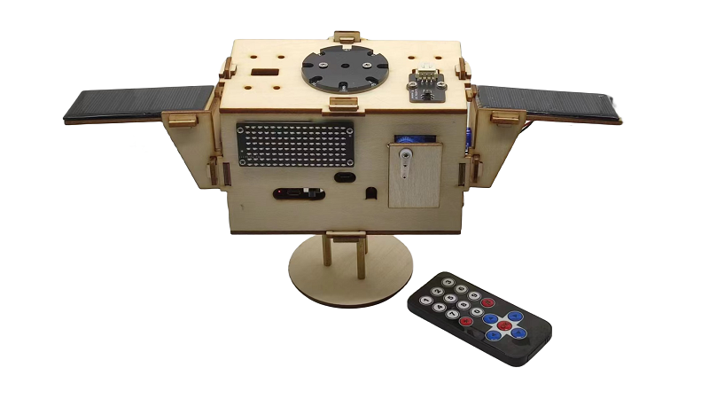
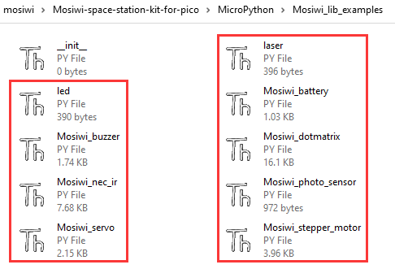

# Overview    
----------
    
This kit provides rich and detailed tutorial materials, very simple installation, many functions, and many interfaces reserved for users to expand by themselves, which is very suitable for DIY or electronics enthusiasts to learn and use.     

## Detailed list                
----------------
| [Raspberry pi pico](https://docs.mosiwi.com/en/latest/raspberry/R1D0001_raspberry_pico/R1D0001_raspberry_pico.html) | [Solar charging shield for pico](https://docs.mosiwi.com/en/latest/raspberry/R1E0000_solar_charging_shield_for_pico/R1E0000_solar_charging_shield_for_pico.html)  | [Light_sensor](https://docs.mosiwi.com/en/latest/common/C1S0000_light_sensor/C1S0000_light_sensor.html) |     
| :--: | :--: | :--: |
|  |  |  |  
| [Dot matrix](https://docs.mosiwi.com/en/latest/common/C1M0000_8x16dot_matrix/C1M0000_8x16dot_matrix.html) | [Servo](https://docs.mosiwi.com/en/latest/outsourcing/sg90_servo/sg90_servo.html) | [Stepper motor](https://docs.mosiwi.com/en/latest/outsourcing/28byj-48/28byj-48.html) |  
|  |  |  |  
| [IR receiver](https://docs.mosiwi.com/en/latest/common/C1S0001_ir_receiver/C1S0001_ir_receiver.html) | [IR remote control](https://docs.mosiwi.com/en/latest/outsourcing/nec_ir_remote_control/nec_ir_remote_control.html) | Laser |              
|  |  |  |    
| Solar panel | USB cable | Wooden boards |  
|  |  |  |  
| 3P XH2.54 cable | 4P XH2.54 cable | 5P XH2.54 cable |      
|  |  |  |     
| M3 nuts | M3\*10mm flat-head screw | M2 nuts |     
|  |  |  |    
| M2\*10mm round-head screw | M2\*8mm round-head screw | M3\*15 dual-pass copper pillar |    
|  |  |  |      
| M3\*8 dual-pass copper pillar |  |  |   
|  |  |  |   

```{tip}
Click on the name in the list to get detailed specifications!   
```

## Troubleshooting            
------------------
**The USB port cannot be identified**    
1. Ensure that the USB cable with data communication function is used or another USB cable with communication function is used for testing.    

**Not working**   
1. [Make sure the battery is properly installed and fully charged.](https://docs.mosiwi.com/en/latest/raspberry/R1E0000_solar_charging_shield_for_pico/R1E0000_solar_charging_shield_for_pico.html)   
2. Make sure the power switch on the shield is turned to "ON".       

**IR remote control does not work or send data short distance**    
1. [IR remote control](https://docs.mosiwi.com/en/latest/outsourcing/nec_ir_remote_control/nec_ir_remote_control.html#notes)

**How to check the good or bad of the components?**   
1. Sample code for all the components is provided in the code of the kit, and you can verify the good and bad of the components.     


