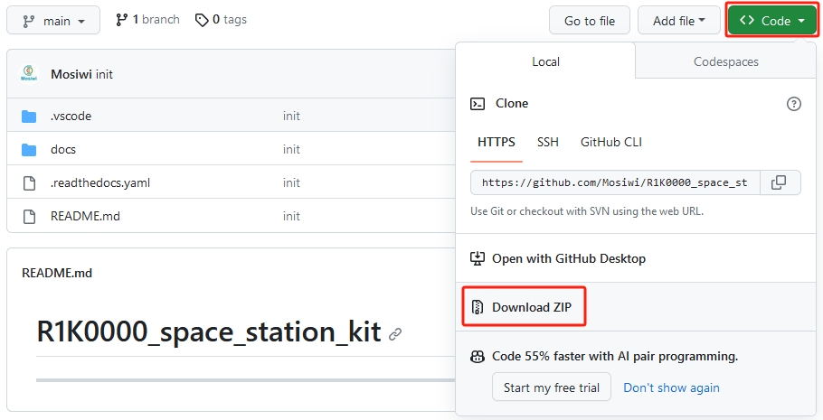
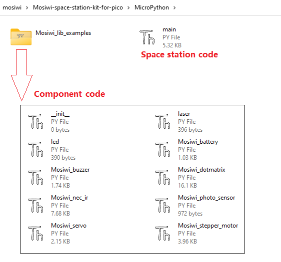
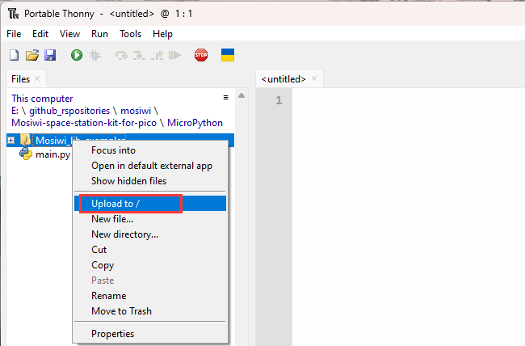
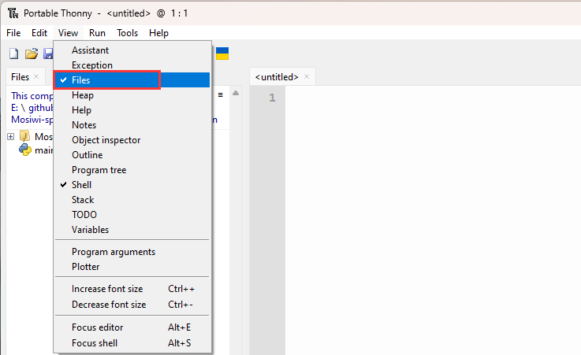
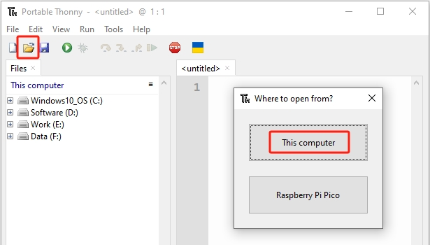
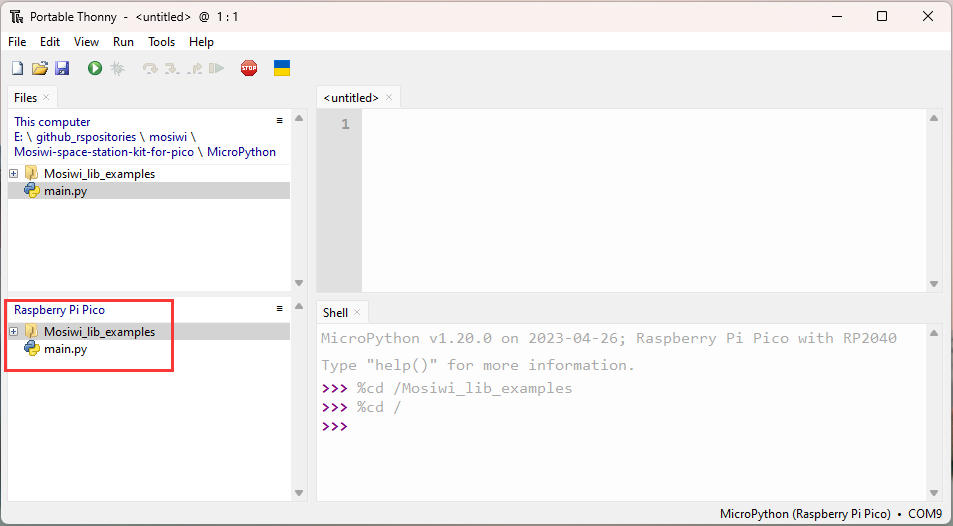
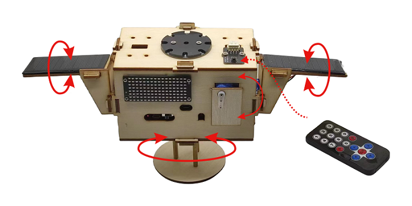
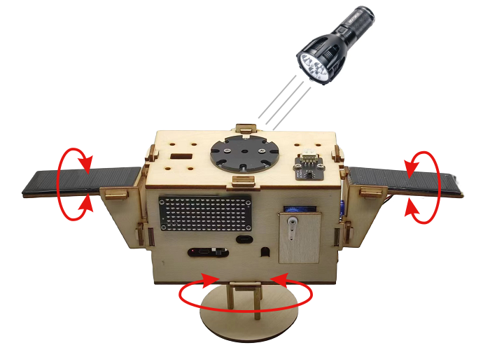

# MicroPython_tutorial   
----------------------
## What is MicroPython?            
-----------------------
MicroPython is a full implementation of the Python 3 programming language that runs directly on embedded hardware like Raspberry Pi Pico. You get an interactive prompt (the REPL) to execute commands immediately via USB Serial, and a built-in filesystem. The Pico port of MicroPython includes modules for accessing low-level chip-specific hardware.      

Resources (Option):     
1. The [MicroPython Wiki](https://github.com/micropython/micropython/wiki)
2. The [MicroPython Forums](https://forum.micropython.org/)   
3. Basic tutorial kit for MicroPython: [Link](https://docs.mosiwi.com/projects/c1k0000/en/latest/)

## Prepared knowledge       
---------------------   
**Pico and Thonny basics <span style="color: rgb(255, 76, 65);">(Important)</span>:**       
If you don't have Pico and Thonny basics, you can follow the link to learn the basics:         
1. Learn about [Pico](https://docs.mosiwi.com/en/latest/raspberry/R1D0001_raspberry_pico/R1D0001_raspberry_pico.html) briefly.     
2. [Using MicroPython in Thonny](https://docs.mosiwi.com/en/latest/raspberry/R1D0001_raspberry_pico/R1D0001_raspberry_pico.html#using-micropython-in-thonny).   
3. [Upload the code to Pico](https://docs.mosiwi.com/en/latest/raspberry/R1D0001_raspberry_pico/R1D0001_raspberry_pico.html#save-existing-files-or-folders-to-pico).

**Learn about (Option):**      
[**MicroPython for Pico**](https://docs.micropython.org/en/latest/rp2/quickref.html).    

## Upload code to Pico        
---------------------- 
**Tools:**     
1. PC(Win10 or uper)     
2. Micro USB cable 

**Download code:**    
Please download the code on Github:         
<https://github.com/Mosiwi/Mosiwi-space-station-kit-for-pico>          
       
Unzip the file downloaded above, and the file in the "**MicroPython**" folder is the code.       
   

**Upload module and main code:**    
Make sure your Raspberry PI Pico's USB is plugged into your computer's USB via a usb cable, then click on **"Python"** and the version number in the bottom right corner of the Thonny window, then select "**MicroPython(Raspberry PI Pico)". COMx** ".     
   

Make sure Thonny checked **"View -> Files"**:  
    

Select **"Mosiwi_lib_examples"** folder:        
      

Then right-click and select the **"Upload to/"** menu to upload the code to Pico:     
   

Follow the same method to upload the **"main\.py"** file to Pico:    
     

```{tip}        
If you save a file to the Pico and give it the special name **main\.py**, then MicroPython starts running that script as soon as power is supplied to Raspberry Pi Pico in the future.    
```

## Assembly        
-----------
```{note}
You must follow the [**previous step**](#upload-code-to-pico) to upload the code before you can install!
```  

Please refer to: [Assembly](../assembly/assembly.md)    

## Control space station    
------------------------   
The [previous steps](#upload-code-to-pico) have uploaded the code of the space station to Pico. After the space station is installed, the space station can be controlled by the infrared remote control, as follows:       

Function of the key:    
| 1 | 2 | 3 |    
| :--: | :--: | :--: |    
| LED switch | Buzzer switch | Laser switch |      
| 5 | 8 | 0 |     
|door switch | Displays battery power | Display light value |   
| ▲ | ▼ | ◀ |     
| Solar panels turn backwards | Solar panels turn forward | Space station turns left |    
| ▶ | OK |  |    
| Space station turns right | Mode switch |  |    

**Remote mode:** The space station is controlled by infrared remote control.       
      

**Auto mode:** The space station automatically tracks the direction of the light and uses the brightness of the light to control the LED.     
       

--------
**End!**    


