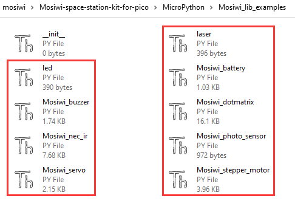

# QA    
----------

## The USB port cannot be identified ?    
------------------------------------
1. Ensure that the USB cable with data communication function is used or another USB cable with communication function is used for testing.    

## Not working ?   
-------------- 
1. [Make sure the battery is properly installed and fully charged.](https://docs.mosiwi.com/en/latest/raspberry/R1E0000_solar_charging_shield_for_pico/R1E0000_solar_charging_shield_for_pico.html)   
2. Make sure the power switch on the shield is turned to "ON".       

## IR remote control does not work or send data short distance ?
--------------------------------------------------------------    
1. [IR remote control](https://docs.mosiwi.com/en/latest/outsourcing/nec_ir_remote_control/nec_ir_remote_control.html#notes)

## How to check the good or bad of the components ?      
--------------------------------------------------  
1. Sample code for all the components is provided in the code of the kit, and you can verify the good and bad of the components.     

